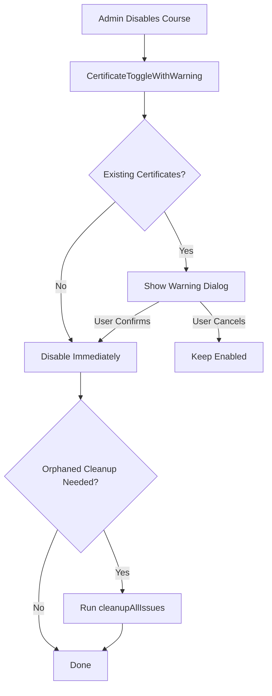

# Certificate Issuance & Cleanup Guide

## Overview

This guide covers the complete certificate management system including:
1. **Certificate Issuance Rules** - How certificates are issued
2. **Course Enable/Disable Logic** - How to control certificate issuance
3. **Cleanup Utilities** - How to find and remove orphaned certificates
4. **Database Integrity** - How to validate certificate data

---

## 1. Certificate Issuance Rules

### ✅ Certificates ARE Issued When:
- User completes a course (`enrollments.completed = true`)
- Course has `certificate_enabled = true`
- No certificate already exists for this user + course combination
- All signature data is available

### ❌ Certificates ARE NOT Issued When:
- Course has `certificate_enabled = false` (disabled)
- Certificate already exists for this user + course
- Course not found or invalid
- Course is deleted (cascade delete removes certificates)

### Code Location: `/lib/courseCompletionService.ts`

```typescript
// Main validation logic (lines 62-72)
console.log(`[CERTIFICATE_CHECK] Course: "${course.title}", certificate_enabled: ${course.certificate_enabled}`);

const isCertificateEnabled = course.certificate_enabled === true;

if (!isCertificateEnabled) {
  console.log(`[CERTIFICATE_BLOCKED] Certificate disabled for course "${course.title}"`);
  return { success: true, issued: false, reason: 'Certificate disabled' };
}
```

### Logging
All certificate operations log with `[CERTIFICATE_*]` tags for easy debugging:
- `[CERTIFICATE_CHECK]` - Validation started
- `[CERTIFICATE_BLOCKED]` - Disabled course detected
- `[CERTIFICATE_DUPLICATE]` - Duplicate prevention
- `[CERTIFICATE_ISSUING]` - About to create
- `[CERTIFICATE_SUCCESS]` - Created successfully
- `[CERTIFICATE_ERROR]` - Error occurred

---

## 2. Course Enable/Disable Logic

### UI Location: `/components/CourseDetailsForm.tsx` (lines 613-641)

**Toggle Section:**
```tsx
{/* Certificate on Completion */}
<div className="flex items-center justify-between p-4 rounded-xl border border-gray-200">
  <div>
    <p className="text-sm font-semibold">Certificate on Completion</p>
    <p className="text-xs text-gray-500">
      {formData.certificate_enabled
        ? 'Learners will receive a certificate when they complete this course'
        : 'No certificate will be issued for this course'}
    </p>
  </div>
  <input type="checkbox" checked={formData.certificate_enabled} onChange={...} />
</div>
```

### Database Field
```sql
Column: courses.certificate_enabled
Type: BOOLEAN
Default: true
Nullable: false
```

### Persistence
When saving course changes (AdminCourses.tsx):
```typescript
Line 505, 536, 559: certificate_enabled: courseData.certificate_enabled === true
```

### Enhanced Component with Warnings
New component: `/components/CertificateToggleWithWarning.tsx`

**Features:**
- Shows count of existing certificates
- Warns before disabling if certificates exist
- Prevents accidental data confusion
- Non-destructive (doesn't delete certificates)

**Usage:**
```tsx
import { CertificateToggleWithWarning } from './CertificateToggleWithWarning';

<CertificateToggleWithWarning
  courseId={courseData.id}
  enabled={formData.certificate_enabled}
  onToggle={(enabled) => {
    setFormData({ ...formData, certificate_enabled: enabled });
    onChange?.({ ...formData, certificate_enabled: enabled });
  }}
/>
```

---

## 3. Cleanup Utilities

### Service Location: `/lib/certificateCleanupService.ts`

#### 3.1 Find Orphaned Certificates
**Orphaned = Issued for a course with `certificate_enabled = false`**

```typescript
const result = await certificateCleanupService.findOrphanedCertificates();

// Returns:
{
  success: true,
  count: 5,
  certificates: [
    {
      id: 'cert-123',
      user_id: 'user-456',
      course_id: 'course-789',
      issued_at: '2024-01-15T10:30:00Z',
      courses: {
        id: 'course-789',
        title: 'Python Basics',
        certificate_enabled: false
      }
    },
    // ... more certificates
  ]
}
```

#### 3.2 Delete Orphaned Certificates
```typescript
// Dry run (check what would be deleted)
const dryRun = await certificateCleanupService.deleteOrphanedCertificates(
  true // dryRun = true
);

// Actually delete
const result = await certificateCleanupService.deleteOrphanedCertificates(
  false // dryRun = false
);

// Returns:
{
  success: true,
  deleted: 5,
  certificateIds: ['cert-1', 'cert-2', ...]
}
```

#### 3.3 Validate All Certificates
```typescript
const result = await certificateCleanupService.validateCertificateIntegrity();

// Returns:
{
  success: true,
  total_issues: 12,
  issues: {
    orphaned_by_disabled_course: [5], // 5 orphaned
    missing_course: [3],                // 3 for deleted courses
    missing_user: [4]                   // 4 for deleted users
  }
}
```

#### 3.4 Cleanup All Issues
```typescript
// Dry run
const dryRun = await certificateCleanupService.cleanupAllIssues(true);

// Actually cleanup
const result = await certificateCleanupService.cleanupAllIssues(false);

// Deletes:
// - Certificates for disabled courses
// - Certificates for deleted courses
// - Certificates for deleted users
// - Also deletes associated signature records
```

---

## 4. API Endpoints

### Location: `/pages/api/admin/certificates.ts`

#### 4.1 GET /api/admin/certificates/validate
Returns certificate integrity report

```bash
curl -X POST http://localhost:3000/api/admin/certificates/validate
```

#### 4.2 POST /api/admin/certificates/cleanup-orphaned
Clean orphaned certificates

```bash
# Dry run (default)
curl -X POST "http://localhost:3000/api/admin/certificates/cleanup-orphaned?dryRun=true"

# Actually delete
curl -X POST "http://localhost:3000/api/admin/certificates/cleanup-orphaned?dryRun=false"
```

#### 4.3 POST /api/admin/certificates/cleanup-all
Clean ALL certificate issues

```bash
# Dry run
curl -X POST "http://localhost:3000/api/admin/certificates/cleanup-all?dryRun=true"

# Actually delete
curl -X POST "http://localhost:3000/api/admin/certificates/cleanup-all?dryRun=false"
```

---

## 5. Database Integrity

### Migration: `20260409_optimize_certificate_queries.sql`

**Adds:**
1. **Indexes** for faster queries:
   - `idx_courses_certificate_enabled` - Find courses by enabled status
   - `idx_certificates_user_course` - Prevent duplicates (UNIQUE)
   - `idx_certificates_course_id` - Find by course
   - `idx_certificates_user_id` - Find by user

2. **Constraints:**
   - `fk_certificates_course_valid` - Ensures valid course reference
   - Data type safety - BOOLEAN for certificate_enabled

3. **Documentation:**
   - Column comments explaining certificate_enabled purpose

---

## 6. Step-by-Step: Fix Disabled Courses

### Problem Statement
> Courses that are no longer enabled should no longer issue certificates, but existing certificates should be preserved.

### Solution

**Step 1: Identify Issues**
```typescript
const validation = await certificateCleanupService.validateCertificateIntegrity();
console.log(`Found ${validation.total_issues} certificate issues`);
```

**Step 2: Dry Run Cleanup**
```typescript
const dryRun = await certificateCleanupService.cleanupAllIssues(true);
console.log(`Would delete ${dryRun.would_delete} certificates`);
console.log('Certificate IDs:', dryRun.certificateIds);
```

**Step 3: Review & Approve**
- Review the list of certificates to be deleted
- Make sure disabling was intentional
- Get stakeholder approval if needed

**Step 4: Actually Delete**
```typescript
const result = await certificateCleanupService.cleanupAllIssues(false);
console.log(`Deleted ${result.cleaned} certificates`);
```

### Course Disablement Flow



---

## 7. Testing

### Test Case 1: Certificate Issuance Prevention
```typescript
// 1. Create course with certificate_enabled = false
// 2. Enroll user and mark complete
// 3. Assert: No certificate created
// 4. Check logs for [CERTIFICATE_BLOCKED]
```

### Test Case 2: Orphaned Certificate Cleanup
```typescript
// 1. Create course with enabled certificates, issue one
// 2. Set certificate_enabled = false
// 3. Run validateCertificateIntegrity()
// 4. Assert: Certificate found in orphaned_by_disabled_course
// 5. Run cleanupAllIssues(true) - verify dry run
// 6. Run cleanupAllIssues(false) - actually delete
// 7. Assert: Certificate deleted, signature records deleted
```

### Test Case 3: Warning Dialog
```typescript
// 1. Navigate to edit enabled course with certificates
// 2. Toggle certificate_enabled to false
// 3. Assert: Warning dialog appears showing count
// 4. Click "Keep Enabled" - assert: toggle reverts
// 5. Click "Disable Certificates" - assert: toggle disables
```

---

## 8. Troubleshooting

### Issue: Certificates still issuing for disabled course
**Check:**
1. Is `certificate_enabled` actually set to false in database?
2. Check browser console for `[CERTIFICATE_BLOCKED]` log
3. Check server logs for error messages
4. Verify course ID is correct

**Solution:**
```typescript
// Manually check in database
SELECT id, title, certificate_enabled FROM courses WHERE title = 'My Course';

// Check certificates for course
SELECT id, user_id, issued_at
FROM certificates
WHERE course_id = 'YOUR-COURSE-ID';
```

### Issue: Can't see warning dialog
**Check:**
1. Is CertificateToggleWithWarning imported correctly?
2. Check if course has `id` prop (needed to query certificates)
3. Check if existing certificates exist
4. Check browser console for errors

### Issue: Cleanup fails
**Solution:**
1. Run validation first: `validateCertificateIntegrity()`
2. Dry run first: `cleanupAllIssues(true)`
3. Check certificate_signatures foreign key constraints
4. Ensure user has admin access

---

## 9. Best Practices

✅ **DO:**
- Use CertificateToggleWithWarning in UI
- Always dry run before actual deletion
- Check validation report before cleanup
- Keep certificate logging enabled
- Document when disabling certificates

❌ **DON'T:**
- Manually delete certificates without validating first
- Disable certificates without checking for existing certs
- Ignore [CERTIFICATE_BLOCKED] logs
- Delete certificates without backup
- Bypass validation checks

---

## 10. Files & Locations

| Purpose | File |
|---------|------|
| Core cleanup logic | `/lib/certificateCleanupService.ts` |
| API endpoints | `/pages/api/admin/certificates.ts` |
| UI with warnings | `/components/CertificateToggleWithWarning.tsx` |
| Certificate service | `/lib/certificateService.ts` |
| Completion hook | `/lib/courseCompletionService.ts` |
| Database optimization | `/supabase/migrations/20260409_optimize_certificate_queries.sql` |
| Course form | `/components/CourseDetailsForm.tsx` |
| Course admin | `/pages/AdminCourses.tsx` |

---

## 11. Summary

### What's Fixed
✅ Certificates are prevented from issuing for disabled courses
✅ Validation in place at 3 different levels (service, completion, UI)
✅ Clear logging for debugging
✅ Orphaned certificate detection and cleanup
✅ Database integrity checks
✅ UI warnings to prevent accidental disabling
✅ Performance indexes for certificate queries

### Impact
- **No Breaking Changes** - Existing certificates unaffected
- **Backward Compatible** - Default is still enabled
- **Safe to Deploy** - All operations are defensive
- **Easy to Use** - Clear APIs and documentation

---

**Created:** April 9, 2026
**Last Updated:** April 9, 2026
